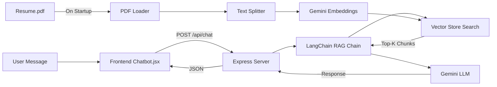

# RAG-Based Chatbot with LangChain + Google Gemini

Replace the unreliable HuggingFace chatbot with a RAG (Retrieval-Augmented Generation) chatbot powered by Google Gemini, grounded in the portfolio's [Resume.pdf](file:///G:/Project/Major%20Project/portfolio-page/public/Resume.pdf).

## Architecture

## Proposed Changes

### Backend — RAG Server

#### [MODIFY] [server/package.json](file:///G:/Project/Major%20Project/portfolio-page/server/package.json)
Add LangChain.js, Gemini, and PDF dependencies:
- `langchain`, `@langchain/core`, `@langchain/google-genai`
- `@langchain/community` (for in-memory vector store)
- `pdf-parse` (for loading Resume.pdf)

#### [MODIFY] [server/.env](file:///G:/Project/Major%20Project/portfolio-page/server/.env)
Add `GOOGLE_API_KEY=<user's Gemini API key>`

#### [NEW] [server/rag.js](file:///G:/Project/Major%20Project/portfolio-page/server/rag.js)
Core RAG module:
- Load [public/Resume.pdf](file:///G:/Project/Major%20Project/portfolio-page/public/Resume.pdf) using LangChain's PDF loader
- Split into chunks with `RecursiveCharacterTextSplitter`
- Create `MemoryVectorStore` using `GoogleGenerativeAIEmbeddings` (`gemini-embedding-001`)
- Export `getRAGResponse(userMessage, chatHistory)` that:
  1. Retrieves top-3 relevant chunks from vector store
  2. Constructs a prompt with portfolio context + retrieved chunks
  3. Calls `ChatGoogleGenerativeAI` (`gemini-2.0-flash`) for response
  4. Returns the response text

#### [MODIFY] [server/server.js](file:///G:/Project/Major%20Project/portfolio-page/server/server.js)
Add `POST /api/chat` endpoint:
- Accepts `{ message, history }` from frontend
- Calls `getRAGResponse()` from `rag.js`
- Returns `{ response }` JSON
- Serves `public/` folder statically for Resume.pdf access

---

### Frontend — Chatbot Integration

#### [MODIFY] [Chatbot.jsx](file:///G:/Project/Major%20Project/portfolio-page/src/components/Chatbot.jsx)
- Remove `@huggingface/inference` dependency and direct HF API calls
- Replace [getBotResponse()](file:///G:/Project/Major%20Project/portfolio-page/src/components/Chatbot.jsx#77-126) to call `POST http://localhost:5000/api/chat`
- Keep all existing UI, quick actions, resume download, and email compose logic intact

---

### Root Config

#### [MODIFY] [.env](file:///G:/Project/Major%20Project/portfolio-page/.env)
- Add `VITE_API_URL=http://localhost:5000` for dev (Netlify can override in production)

> [!IMPORTANT]
> You need a **Google Gemini API key** (free tier available). Get one from https://aistudio.google.com/apikey

## Verification Plan

### Automated Tests
1. Start the server: `cd server && npm run dev`
2. Start the frontend: `npm run dev`
3. Open browser → click chatbot → ask "What are your skills?"
4. Verify response is grounded in Resume.pdf content
5. Test resume download and email compose still work
